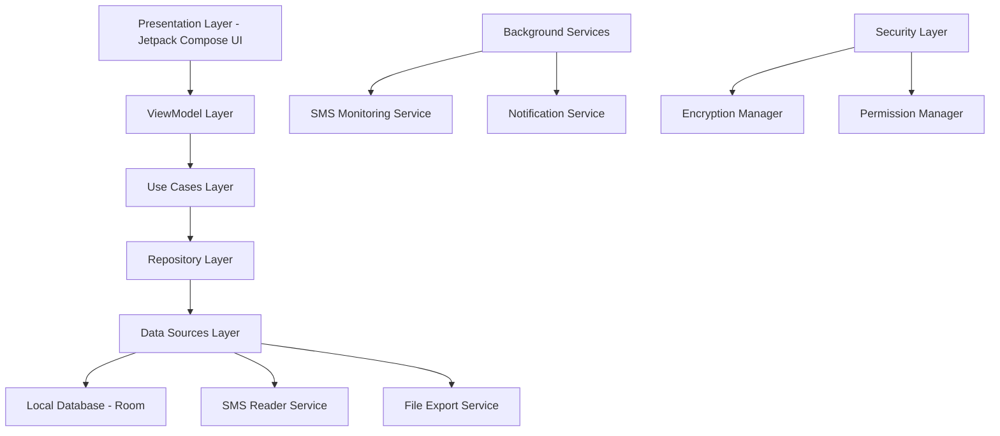

# Design Document

## Overview

The Android Expense Tracker App is architected as a modern Android application using MVVM (Model-View-ViewModel) pattern with Clean Architecture principles. The app leverages Jetpack Compose for UI, Room database for local storage, and implements a sophisticated SMS parsing engine for automatic transaction detection. The design prioritizes user privacy, offline functionality, and seamless user experience while maintaining high performance and security standards.

## Architecture

### High-Level Architecture



### Layer Responsibilities

**Presentation Layer (UI)**
- Jetpack Compose screens and components
- State management and UI events
- Navigation handling
- Theme and styling

**ViewModel Layer**
- UI state management
- Business logic coordination
- LiveData/StateFlow for reactive UI updates
- Input validation and formatting

**Use Cases Layer**
- Business logic implementation
- Transaction processing rules
- Categorization algorithms
- Data transformation logic

**Repository Layer**
- Data access abstraction
- Caching strategies
- Data synchronization
- Error handling and retry logic

**Data Sources Layer**
- Room database operations
- SMS content access
- File system operations
- Shared preferences management

## Components and Interfaces

### Core Components

#### 1. SMS Processing Engine

```kotlin
interface SmsProcessor {
    suspend fun processSmsMessage(message: SmsMessage): TransactionResult?
    fun registerBankPattern(pattern: BankSmsPattern)
    fun getConfidenceScore(message: SmsMessage): Float
}

class SmartSmsProcessor : SmsProcessor {
    private val bankPatterns: List<BankSmsPattern>
    private val mlCategorizer: TransactionCategorizer
    private val amountExtractor: AmountExtractor
    private val dateExtractor: DateExtractor
}
```

#### 2. Transaction Management

```kotlin
interface TransactionRepository {
    suspend fun insertTransaction(transaction: Transaction): Long
    suspend fun updateTransaction(transaction: Transaction)
    suspend fun deleteTransaction(id: Long)
    suspend fun getTransactionsByDateRange(start: LocalDate, end: LocalDate): List<Transaction>
    suspend fun getTransactionsByCategory(category: Category): List<Transaction>
    fun observeTransactions(): Flow<List<Transaction>>
}

data class Transaction(
    val id: Long = 0,
    val amount: BigDecimal,
    val type: TransactionType,
    val category: Category,
    val merchant: String,
    val description: String?,
    val date: LocalDateTime,
    val source: TransactionSource,
    val accountId: Long,
    val transferAccountId: Long? = null, // For transfer transactions
    val transferTransactionId: Long? = null, // Linked transfer transaction
    val isRecurring: Boolean = false
)
```

#### 3. Categorization System

```kotlin
interface TransactionCategorizer {
    suspend fun categorizeTransaction(transaction: Transaction): Category
    suspend fun learnFromUserInput(transaction: Transaction, userCategory: Category)
    suspend fun suggestCategories(merchant: String): List<Category>
}

class SmartCategorizer : TransactionCategorizer {
    private val keywordMatcher: KeywordMatcher
    private val merchantDatabase: MerchantDatabase
    private val userPreferences: UserPreferences
}
```

#### 4. Analytics Engine

```kotlin
interface AnalyticsEngine {
    suspend fun generateMonthlyReport(month: YearMonth): MonthlyReport
    suspend fun getCategoryBreakdown(period: DateRange): CategoryBreakdown
    suspend fun detectSpendingAnomalies(): List<SpendingAnomaly>
    suspend fun calculateTrends(): SpendingTrends
}

data class MonthlyReport(
    val totalIncome: BigDecimal,
    val totalExpenses: BigDecimal,
    val categoryBreakdown: Map<Category, BigDecimal>,
    val topMerchants: List<MerchantSpending>,
    val comparisonToPreviousMonth: MonthComparison
)
```

### Database Schema

#### Room Database Entities

```kotlin
@Entity(tableName = "transactions")
data class TransactionEntity(
    @PrimaryKey(autoGenerate = true)
    val id: Long = 0,
    val amount: String, // Stored as string to preserve precision
    val type: String,
    val categoryId: Long,
    val accountId: Long,
    val merchant: String,
    val description: String?,
    val date: Long, // Unix timestamp
    val source: String,
    val transferAccountId: Long?,
    val transferTransactionId: Long?,
    val isRecurring: Boolean,
    val createdAt: Long,
    val updatedAt: Long
)

@Entity(tableName = "accounts")
data class AccountEntity(
    @PrimaryKey(autoGenerate = true)
    val id: Long = 0,
    val bankName: String,
    val accountType: String,
    val accountNumber: String,
    val nickname: String,
    val currentBalance: String,
    val isActive: Boolean,
    val createdAt: Long
)

@Entity(tableName = "categories")
data class CategoryEntity(
    @PrimaryKey(autoGenerate = true)
    val id: Long = 0,
    val name: String,
    val icon: String,
    val color: String,
    val isDefault: Boolean,
    val parentCategoryId: Long?
)

@Entity(tableName = "sms_patterns")
data class SmsPatternEntity(
    @PrimaryKey(autoGenerate = true)
    val id: Long = 0,
    val bankName: String,
    val senderPattern: String,
    val amountPattern: String,
    val merchantPattern: String,
    val datePattern: String,
    val typePattern: String,
    val isActive: Boolean
)
```

## Data Models

### Core Domain Models

```kotlin
enum class TransactionType {
    INCOME, EXPENSE, TRANSFER_OUT, TRANSFER_IN
}

data class Account(
    val id: Long = 0,
    val bankName: String,
    val accountType: AccountType,
    val accountNumber: String,
    val nickname: String,
    val currentBalance: BigDecimal,
    val isActive: Boolean = true,
    val createdAt: LocalDateTime
)

enum class AccountType {
    SAVINGS, CHECKING, CREDIT_CARD, INVESTMENT, CASH
}

enum class TransactionSource {
    SMS_AUTO, MANUAL, IMPORTED
}

data class Category(
    val id: Long,
    val name: String,
    val icon: String,
    val color: Color,
    val isDefault: Boolean,
    val parentCategory: Category? = null
) {
    companion object {
        val DEFAULT_CATEGORIES = listOf(
            Category(1, "Food & Dining", "restaurant", Color.Orange, true),
            Category(2, "Shopping", "shopping_cart", Color.Blue, true),
            Category(3, "Transportation", "directions_car", Color.Green, true),
            Category(4, "Bills & Utilities", "receipt", Color.Red, true),
            Category(5, "Entertainment", "movie", Color.Purple, true),
            Category(6, "Healthcare", "local_hospital", Color.Pink, true),
            Category(7, "Investment", "trending_up", Color.Teal, true),
            Category(8, "Income", "attach_money", Color.LightGreen, true)
        )
    }
}

data class BankSmsPattern(
    val bankName: String,
    val senderPattern: Regex,
    val amountPattern: Regex,
    val merchantPattern: Regex,
    val datePattern: Regex,
    val typeIndicators: Map<String, TransactionType>
)
```

### UI State Models

```kotlin
data class DashboardUiState(
    val isLoading: Boolean = false,
    val accounts: List<Account> = emptyList(),
    val totalBalance: BigDecimal = BigDecimal.ZERO,
    val monthlySpending: BigDecimal = BigDecimal.ZERO,
    val monthlyIncome: BigDecimal = BigDecimal.ZERO,
    val categoryBreakdown: List<CategorySpending> = emptyList(),
    val recentTransactions: List<Transaction> = emptyList(),
    val spendingTrend: SpendingTrend? = null,
    val alerts: List<FinancialAlert> = emptyList(),
    val error: String? = null
)

data class TransactionListUiState(
    val transactions: List<Transaction> = emptyList(),
    val isLoading: Boolean = false,
    val selectedDateRange: DateRange = DateRange.currentMonth(),
    val selectedCategories: Set<Category> = emptySet(),
    val searchQuery: String = "",
    val sortOrder: SortOrder = SortOrder.DATE_DESC
)
```

## Error Handling

### Error Types and Strategies

#### 1. SMS Processing Errors

```kotlin
sealed class SmsProcessingError : Exception() {
    object PermissionDenied : SmsProcessingError()
    object InvalidSmsFormat : SmsProcessingError()
    object AmountParsingFailed : SmsProcessingError()
    object UnknownBankFormat : SmsProcessingError()
    data class ProcessingTimeout(val message: String) : SmsProcessingError()
}

class SmsErrorHandler {
    fun handleError(error: SmsProcessingError): ErrorAction {
        return when (error) {
            is SmsProcessingError.PermissionDenied -> ErrorAction.RequestPermission
            is SmsProcessingError.InvalidSmsFormat -> ErrorAction.LogAndContinue
            is SmsProcessingError.AmountParsingFailed -> ErrorAction.ManualReview
            is SmsProcessingError.UnknownBankFormat -> ErrorAction.LearnPattern
            is SmsProcessingError.ProcessingTimeout -> ErrorAction.RetryLater
        }
    }
}
```

#### 2. Database Errors

```kotlin
sealed class DatabaseError : Exception() {
    object ConnectionFailed : DatabaseError()
    object ConstraintViolation : DatabaseError()
    object DataCorruption : DatabaseError()
    data class MigrationFailed(val fromVersion: Int, val toVersion: Int) : DatabaseError()
}

class DatabaseErrorHandler {
    suspend fun handleError(error: DatabaseError): Boolean {
        return when (error) {
            is DatabaseError.ConnectionFailed -> retryConnection()
            is DatabaseError.ConstraintViolation -> validateAndCleanData()
            is DatabaseError.DataCorruption -> attemptDataRecovery()
            is DatabaseError.MigrationFailed -> rollbackAndNotifyUser(error)
        }
    }
}
```

#### 3. Export Errors

```kotlin
sealed class ExportError : Exception() {
    object InsufficientStorage : ExportError()
    object PermissionDenied : ExportError()
    object DataTooLarge : ExportError()
    data class FormatNotSupported(val format: String) : ExportError()
}
```

## Testing Strategy

### Unit Testing

#### 1. SMS Processing Tests

```kotlin
class SmsProcessorTest {
    @Test
    fun `should extract transaction from HDFC bank SMS`() {
        val smsMessage = createHdfcSmsMessage()
        val result = smsProcessor.processSmsMessage(smsMessage)
        
        assertThat(result).isNotNull()
        assertThat(result.amount).isEqualTo(BigDecimal("1500.00"))
        assertThat(result.merchant).isEqualTo("AMAZON")
        assertThat(result.type).isEqualTo(TransactionType.EXPENSE)
    }
    
    @Test
    fun `should handle malformed SMS gracefully`() {
        val malformedSms = createMalformedSmsMessage()
        val result = smsProcessor.processSmsMessage(malformedSms)
        
        assertThat(result).isNull()
    }
}
```

#### 2. Categorization Tests

```kotlin
class TransactionCategorizerTest {
    @Test
    fun `should categorize Amazon transaction as Shopping`() = runTest {
        val transaction = createAmazonTransaction()
        val category = categorizer.categorizeTransaction(transaction)
        
        assertThat(category.name).isEqualTo("Shopping")
    }
    
    @Test
    fun `should learn from user corrections`() = runTest {
        val transaction = createUberTransaction()
        categorizer.learnFromUserInput(transaction, Category.FOOD)
        
        val nextUberTransaction = createUberTransaction()
        val category = categorizer.categorizeTransaction(nextUberTransaction)
        
        assertThat(category.name).isEqualTo("Food & Dining")
    }
}
```

### Integration Testing

#### 1. Database Integration Tests

```kotlin
@RunWith(AndroidJUnit4::class)
class TransactionRepositoryTest {
    @get:Rule
    val instantTaskExecutorRule = InstantTaskExecutorRule()
    
    private lateinit var database: ExpenseDatabase
    private lateinit var repository: TransactionRepository
    
    @Before
    fun setup() {
        database = Room.inMemoryDatabaseBuilder(
            ApplicationProvider.getApplicationContext(),
            ExpenseDatabase::class.java
        ).allowMainThreadQueries().build()
        
        repository = TransactionRepositoryImpl(database.transactionDao())
    }
    
    @Test
    fun insertAndRetrieveTransaction() = runTest {
        val transaction = createSampleTransaction()
        val id = repository.insertTransaction(transaction)
        
        val retrieved = repository.getTransaction(id)
        assertThat(retrieved).isEqualTo(transaction.copy(id = id))
    }
}
```

### UI Testing

#### 1. Compose UI Tests

```kotlin
@RunWith(AndroidJUnit4::class)
class DashboardScreenTest {
    @get:Rule
    val composeTestRule = createComposeRule()
    
    @Test
    fun displaysMonthlySpendingSummary() {
        val uiState = DashboardUiState(
            monthlySpending = BigDecimal("5000.00"),
            monthlyIncome = BigDecimal("8000.00")
        )
        
        composeTestRule.setContent {
            DashboardScreen(uiState = uiState)
        }
        
        composeTestRule.onNodeWithText("₹5,000.00").assertIsDisplayed()
        composeTestRule.onNodeWithText("₹8,000.00").assertIsDisplayed()
    }
    
    @Test
    fun navigatesToTransactionListOnClick() {
        composeTestRule.setContent {
            DashboardScreen(
                uiState = DashboardUiState(),
                onNavigateToTransactions = { /* verify navigation */ }
            )
        }
        
        composeTestRule.onNodeWithText("View All Transactions").performClick()
        // Verify navigation occurred
    }
}
```

### Performance Testing

#### 1. SMS Processing Performance

```kotlin
class SmsProcessingPerformanceTest {
    @Test
    fun `should process 1000 SMS messages within 5 seconds`() = runTest {
        val messages = generateSmsMessages(1000)
        
        val startTime = System.currentTimeMillis()
        messages.forEach { smsProcessor.processSmsMessage(it) }
        val endTime = System.currentTimeMillis()
        
        val processingTime = endTime - startTime
        assertThat(processingTime).isLessThan(5000) // 5 seconds
    }
}
```

#### 2. Database Performance

```kotlin
class DatabasePerformanceTest {
    @Test
    fun `should insert 10000 transactions within 2 seconds`() = runTest {
        val transactions = generateTransactions(10000)
        
        val startTime = System.currentTimeMillis()
        repository.insertTransactions(transactions)
        val endTime = System.currentTimeMillis()
        
        val insertTime = endTime - startTime
        assertThat(insertTime).isLessThan(2000) // 2 seconds
    }
}
```

## Security Considerations

### Data Encryption

- All sensitive data stored using Android Keystore
- SMS content processed in memory only, never persisted in plain text
- Database encryption using SQLCipher
- Secure key generation and rotation

### Permission Management

- Runtime permission requests with clear explanations
- Graceful degradation when permissions are denied
- Regular permission status checks
- User-controlled permission revocation

### Privacy Protection

- No network communication for SMS data
- Local-only processing and storage
- Clear data deletion on app uninstall
- Transparent privacy policy and data usage

This design provides a robust, scalable, and secure foundation for the Android Expense Tracker App while maintaining high performance and excellent user experience.